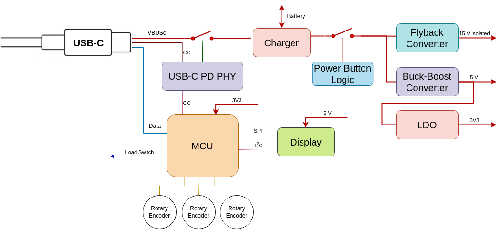

# Code and hardware design files

## Block diagram

### Overall system

> TODO

### Controller 

## Boards

### Bidirectional Load Switch

#### Known issues

- v0.1.0
    - Insufficient spacing on the AC connector 'AC\_in' net to 'earth' net
        - Workaround: Manually increase spacing
    - Lack of diode inline with 5 volt supply which would cause an issue if 5 volts and 3v3 (from ISP header) are supplied simultaneously 
        - Workaround: Don't supply both simultaneously
    - Lack of pulldown resistor on the !fault signal from the Attiny85 which could potentially have the gate driver inputs float, resulting in sporadic channel activation
        - Sporadic activation is likely only possible during power cycling as the gate drivers are internally pulled down. 

