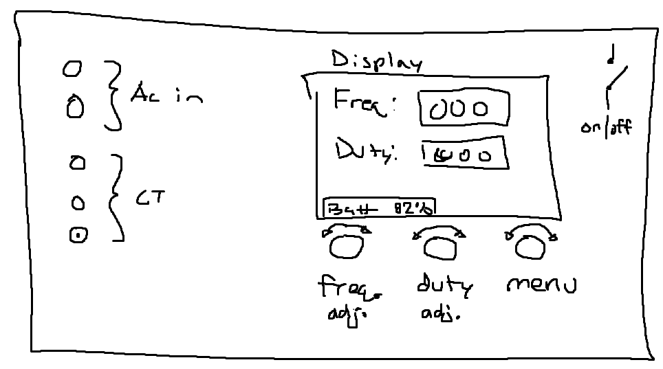

# Code and hardware design files

## Device

### Front panel

## Bidirectional Load Switch

### Render

### Schematic

#### Overall

#### Channel 1

#### Front copper

#### Back copper

#### Combined copper

### Known issues
- v0.1.0
    - Insufficient spacing on the AC connector 'AC_in' net to 'earth' net
    - Lack of diode inline with 5 volt supply which would cause an issue if 5 volts and 3v3 (from ISP header) are supplied simultaneously 
    - The overline (for negative logic) of ' $ \overline{\text{fault\_reset}} $ ' silkscreen is difficult to read