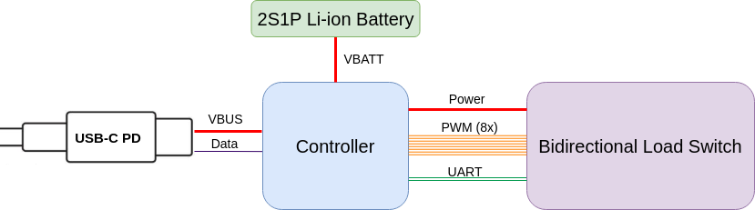

# Code and hardware design files

## Block diagram

### Overall system

### Power supply

## Boards

### Bidirectional Load Switch

#### Known issues

- v0.1.0
    - Insufficient spacing on the AC connector 'AC_in' net to 'earth' net
    - Lack of diode inline with 5 volt supply which would cause an issue if 5 volts and 3v3 (from ISP header) are supplied simultaneously 
