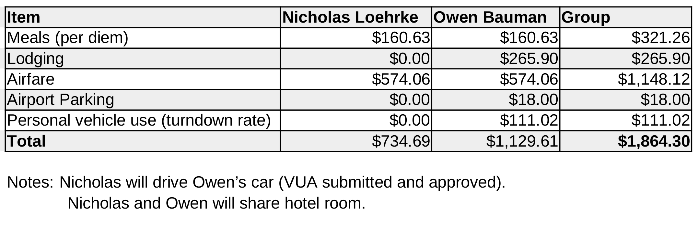
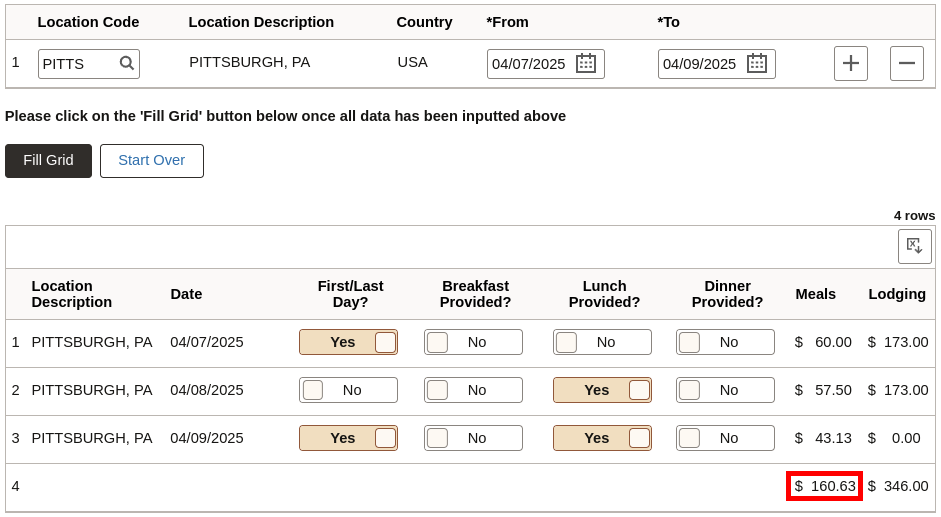
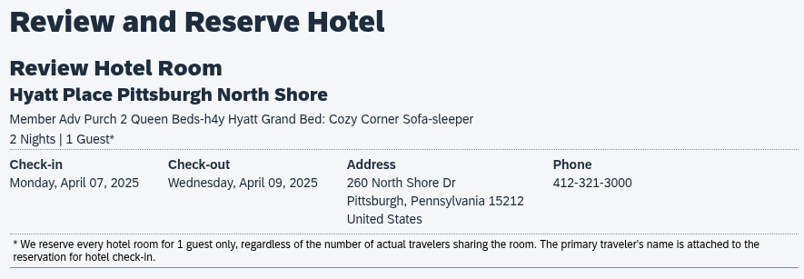
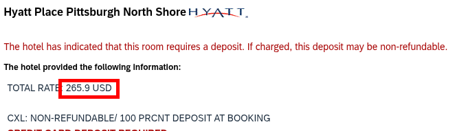
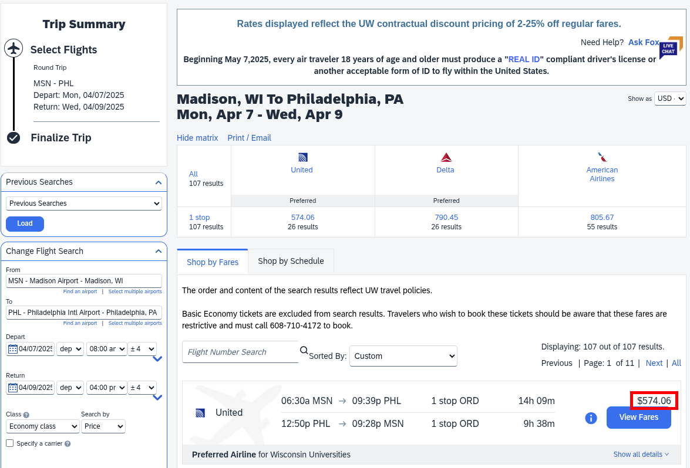
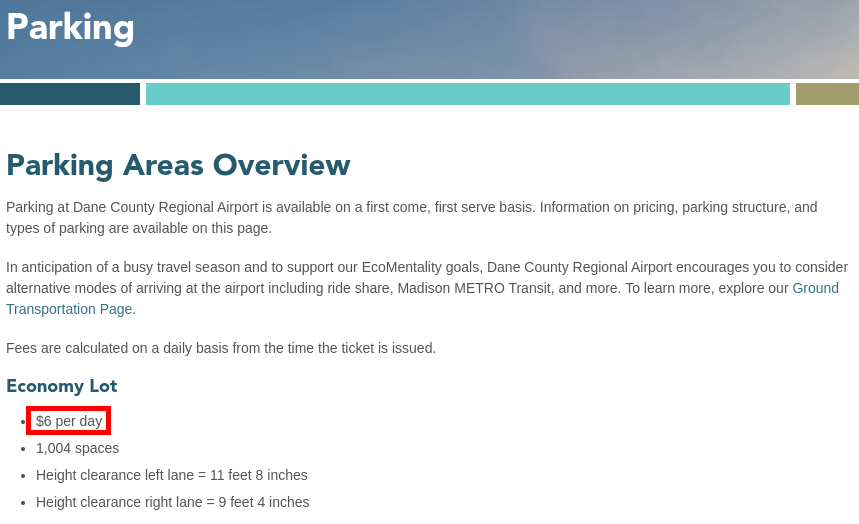
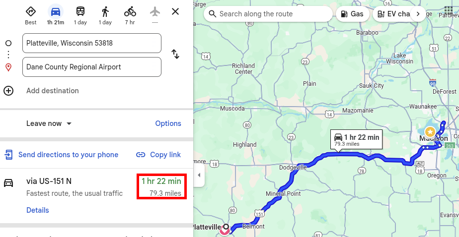

# Budget Breakdown

## 1. Meals (Per Diem)

## 2. Lodging

> Nicholas's and Owen's shared two-bed hotel room

## 3. Airfare

## 4. Airport Parking (MSN)

> $$ \frac{$6}{\text{day}} * 3\ \text{days} = $18 $$

## 5. Personal Vehicle Use (Turndown Rate)

> $$ \frac{$0.70}{\text{mile}} * 79.3\ \text{miles} * 2 = $111.02 $$

